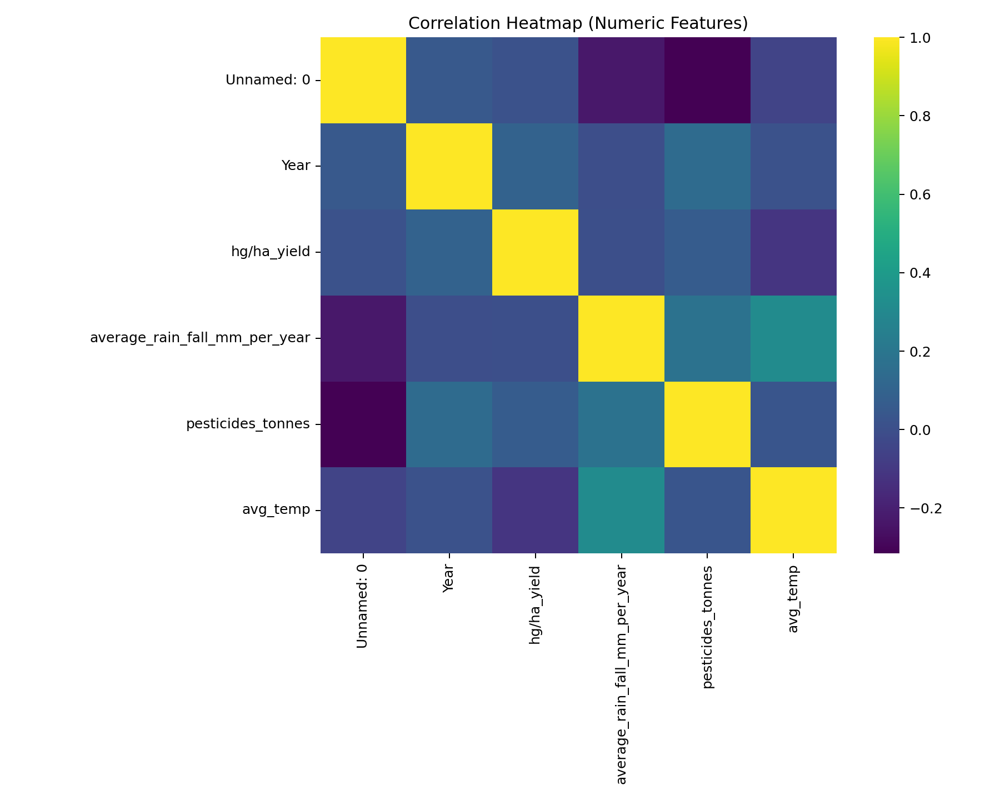

AgriMind – Training, Prediction & Visualization (README)

This repo contains simple, end-to-end scripts to:

Train a crop-yield regression model and save artifacts (.pkl, .h5, .yaml, .json).

Predict on new CSVs using the saved preprocessor + model.

Visualize training curves, feature correlations, and “predicted vs. actual” heatmaps.

Everything is set up for Windows paths like:

C:\Users\sagni\Downloads\Agri Mind\
└─ archive\
   ├─ pesticides.csv
   ├─ rainfall.csv
   ├─ temp.csv
   ├─ yield.csv
   └─ yield_df.csv        # pre-merged dataset (preferred)

1) Requirements

Python 3.10–3.11 (recommended)

Recommended packages:

pip install -U numpy pandas scikit-learn joblib pyyaml matplotlib seaborn
pip install -U tensorflow==2.13.*  # or 2.14/2.15 if your GPU/CPU build supports it

If you don’t need seaborn, you can skip it; plots will fall back to pure Matplotlib.

2) Files & What They Do

train_agri.py
Trains a Keras regression model for yield using the CSVs in archive\, builds a sklearn preprocessing pipeline, and saves:

neuro_preprocess.pkl (preprocessor bundle with column handling)

neuro_model.h5 (Keras model)

neuro_config.yaml (run metadata & config)

neuro_metrics.json (train/test metrics)

neuro_history.csv (per-epoch training history)

predict_agri.py
Loads neuro_preprocess.pkl + neuro_model.h5 and predicts on a CSV. Writes predictions.csv (with top columns preserved + prediction column).

viz_agri.py
Generates and shows:

neuro_accuracy_mae.png — MAE vs. epochs

neuro_accuracy_loss.png — Loss vs. epochs

neuro_corr_heatmap.png — correlation heatmap

neuro_pred_vs_actual_heatmap.png — predicted vs. actual heatmap
(Uses compile=False when loading .h5 to avoid legacy Keras metric issues.)

If you asked for the “show results” version, that’s the script you received last; it displays plots inline in Jupyter and opens PNGs in Windows if run as a script.

3) Dataset Expectations

Use the pre-merged yield_df.csv if present (it’s fastest). Otherwise, train_agri.py will merge: pesticides.csv, rainfall.csv, temp.csv, yield.csv into a single DataFrame.

Target column is auto-detected from:

["hg/ha_yield", "yield", "Yield", "target", "y"]

If none is found, the script falls back to the last numeric column (you can override it in code).

Typical columns you may have:

Area / Country / Item (categorical)

Year (numeric or int)

Weather features: temperature, rainfall

Inputs: pesticides/fertilizers

Target: hg/ha_yield

Row-ID columns like Unnamed: 0 are dropped automatically.

4) Configuration (Paths)

All scripts use these defaults (edit at the top of each script):

BASE_DIR = r"C:\Users\sagni\Downloads\Agri Mind"
ARCHIVE  = os.path.join(BASE_DIR, "archive")

# Artifacts
PKL_PATH = os.path.join(BASE_DIR, "neuro_preprocess.pkl")
H5_PATH  = os.path.join(BASE_DIR, "neuro_model.h5")
HISTCSV  = os.path.join(BASE_DIR, "neuro_history.csv")

5) How to Run
A) Train & Export Artifacts
# From the folder containing train_agri.py
python train_agri.py

Outputs (in BASE_DIR):

neuro_preprocess.pkl

neuro_model.h5

neuro_config.yaml

neuro_metrics.json

neuro_history.csv

If you only have yield_df.csv, it will use that directly. Otherwise it will try to merge pesticides.csv, rainfall.csv, temp.csv, yield.csv.

B) Predict on a CSV
# From the folder containing predict_agri.py
python predict_agri.py --pkl "C:\Users\sagni\Downloads\Agri Mind\neuro_preprocess.pkl" ^
  --model "C:\Users\sagni\Downloads\Agri Mind\neuro_model.h5" ^
  --input "C:\Users\sagni\Downloads\Agri Mind\archive\yield_df.csv" ^
  --out "C:\Users\sagni\Downloads\Agri Mind\predictions.csv"

If your input has the target column, it will be ignored for inference.

The output CSV gains a prediction column.

C) Visualize (Accuracy & Heatmaps)
# From the folder containing viz_agri.py
python viz_agri.py

Creates:

neuro_accuracy_mae.png

neuro_accuracy_loss.png

neuro_corr_heatmap.png

neuro_pred_vs_actual_heatmap.png

…and shows them automatically (inline in Jupyter, or opens in Windows).

6) Tips & Customization

Change target column:
Edit the POSSIBLE_TARGETS list in the scripts or set target_col explicitly inside the training code.

Model capacity:
Adjust hidden layers, units, dropout, learning rate inside build_model(...) in train_agri.py.

Train/validation split:
Default is standard random split. If your data are time series by Year, consider a time-based split.

Categorical encoding:
We use OneHotEncoder(handle_unknown="ignore") (no sparse= arg for new scikit-learn).

Large OHE:
Many categories increase feature dimensionality. Consider target encoding or hashing if needed.

7) Common Errors & Fixes

FileNotFoundError: ...\archive\yield_df.csv
Make sure your dataset path matches DF_PATH. Put your CSVs under archive\ or adjust the path.

Keras .h5 load error like:

TypeError: Could not locate function 'mse' ...

We load models with compile=False:

keras.models.load_model(H5_PATH, compile=False)

This avoids legacy metric deserialization issues.

OneHotEncoder.__init__() got an unexpected keyword argument 'sparse'
New scikit-learn uses sparse_output instead of sparse (we don’t pass sparse in these scripts).

ValueError: The feature names should match those that were passed during fit.
Ensure you use the same preprocessor (neuro_preprocess.pkl) with the same column names as training. Don’t rename or add columns between train & inference.

Matplotlib/SVG backend issues
If images don’t display interactively, the script still saves PNGs. Open them from BASE_DIR.

8) Results & Metrics

After training, check:

neuro_metrics.json for MAE/MSE/RMSE/R² on train/test.

neuro_history.csv for per-epoch logs.

Plots in BASE_DIR to visually inspect overfitting (MAE/Loss gaps) and calibration (pred vs actual).

9) Project Structure (suggested)
Agri Mind/
├─ archive/
│  ├─ pesticides.csv
│  ├─ rainfall.csv
│  ├─ temp.csv
│  ├─ yield.csv
│  └─ yield_df.csv
├─ train_agri.py
├─ predict_agri.py
├─ viz_agri.py
├─ neuro_preprocess.pkl          # (created by training)
├─ neuro_model.h5                # (created by training)
├─ neuro_config.yaml             # (created by training)
├─ neuro_metrics.json            # (created by training)
├─ neuro_history.csv             # (created by training)
└─ README.md
Author
SAGNIK PATRA
